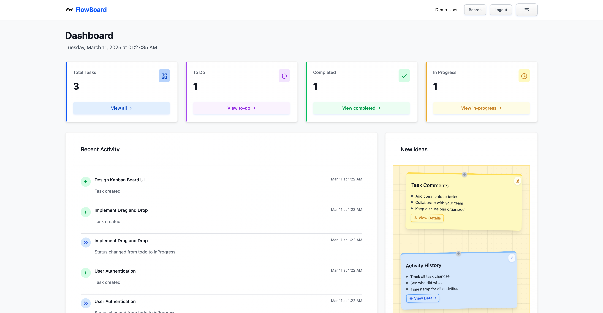
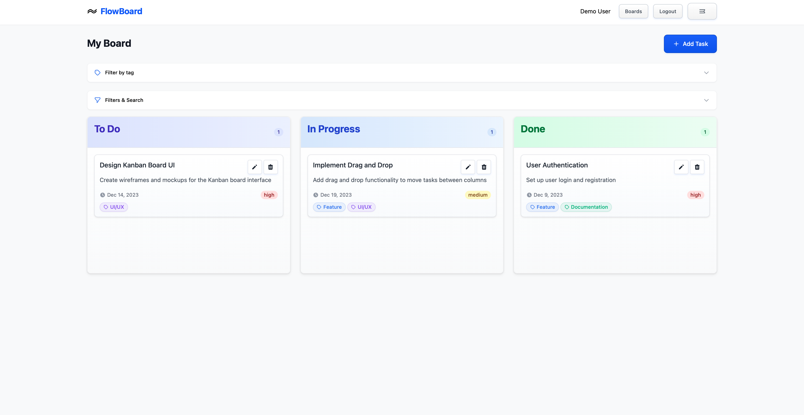
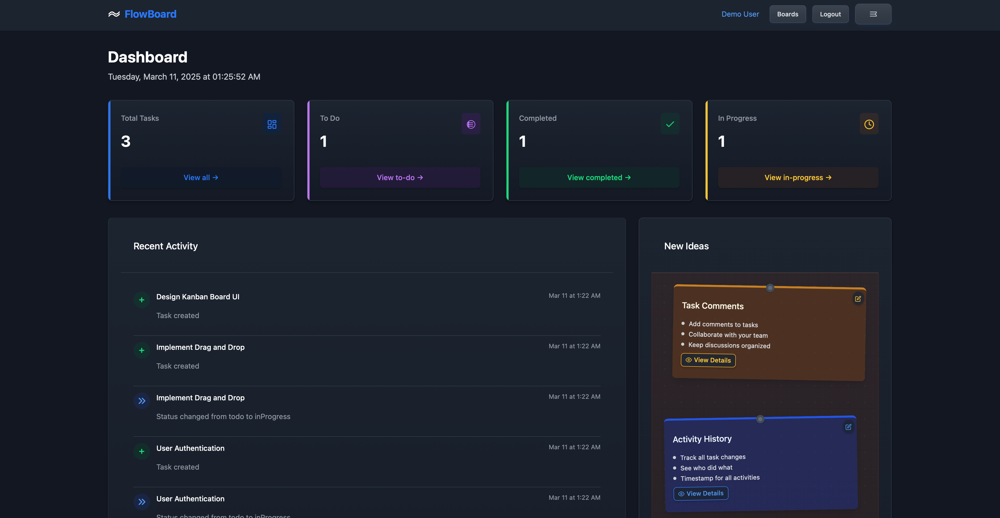
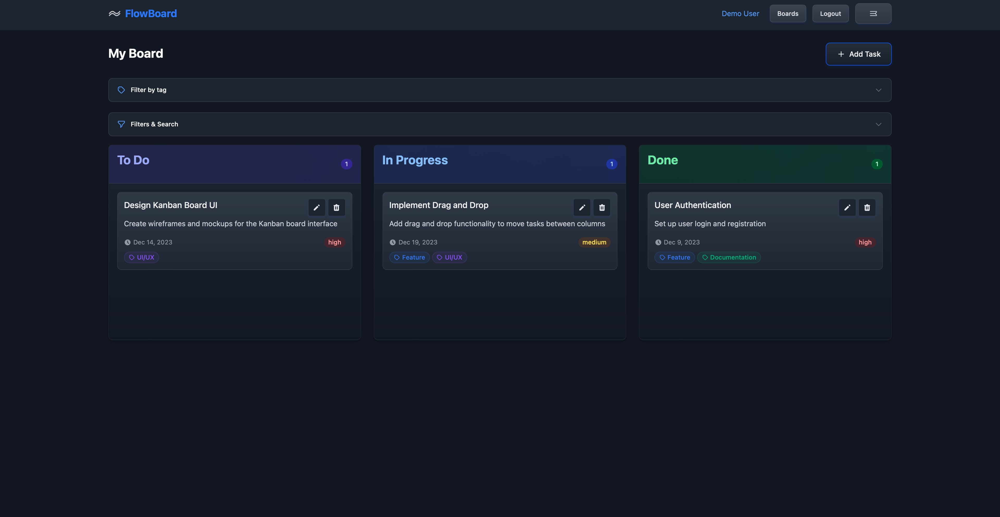
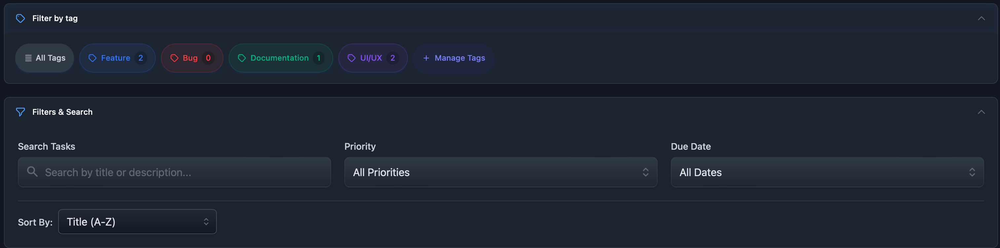
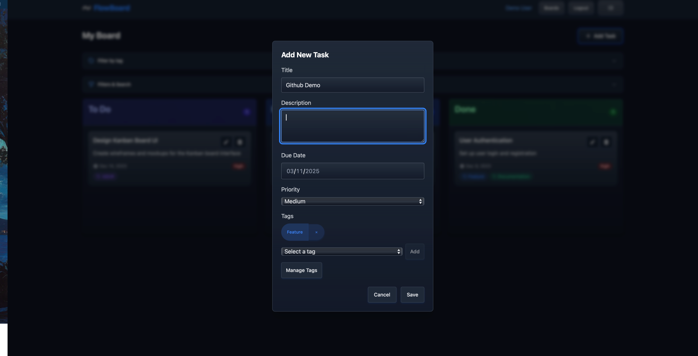

## FlowBoard - Task Management Application

A sleek and intuitive task management application designed for efficient workflow management.

---

## 🚀 Features

🔑 User Authentication - Secure login and registration.

📌 Kanban Board - Drag-and-drop task management.

📝 Task Management - Create, edit, and delete tasks.

⚡ Prioritization - Set task priorities and due dates.

📱 Responsive Design - Works across all devices.

💾 Local Storage Persistence - Saves data even after refresh.

---

## 🛠 Tech Stack

Frontend: Vue 3 (Composition API), Vue Router, Pinia

Styling: TailwindCSS

Networking: Axios

Build Tool: Vite

---

## 📦 Project Setup

```bash
# Install dependencies
npm install

# Start development server
npm run dev

# Build for production
npm run build
```

---

## 📂 Project Structure

```
flowboard/
├── public/              # Static assets
├── src/
│   ├── api/             # API services
│   ├── assets/          # Images, fonts, etc.
│   │   └── css/         # CSS files
│   ├── components/      # Reusable Vue components
│   ├── store/           # Pinia stores
│   ├── views/           # Page components
│   ├── App.vue          # Root component
│   └── main.js          # Application entry point
├── index.html           # HTML template
├── package.json         # Project dependencies
├── tailwind.config.js   # TailwindCSS configuration
└── vite.config.js       # Vite configuration
```
---

## 📸 Demo Screenshots








---

## 🔮 Future Enhancements

🌐 Backend Integration - RESTful API for data persistence.

🔄 Real-time Updates - WebSockets for live changes.

📊 Multiple Board Support - Manage different workflows.

🤝 Collaboration Tools - Team-based task management.

🌙 Dark Mode - Toggle between light and dark themes.

---

📜 License

This project is licensed under the MIT License @ Mohamed


